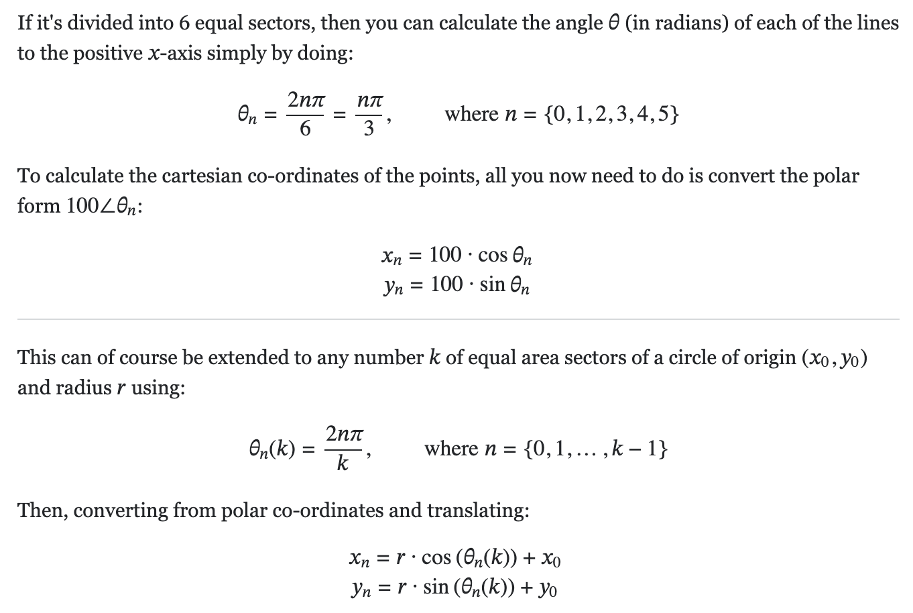

# DCOP-MDP Model

## Dividing circle into n equal parts and know the coordinates of each diving point ...

[sof | credit](https://math.stackexchange.com/a/206662)

## Credits

- [matplotlib | Creating annotated heatmaps](https://matplotlib.org/stable/gallery/images_contours_and_fields/image_annotated_heatmap.html)
- [wiki | MDP](https://en.wikipedia.org/wiki/Markov_decision_process)
- [sof | Matplotlib different size subplots](https://stackoverflow.com/a/35881382/13993545)